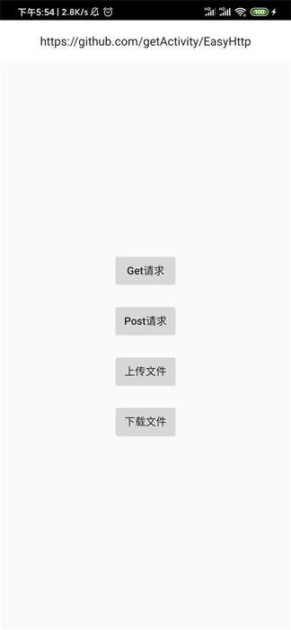

# 网络请求框架

> 码云地址：[Gitee](https://gitee.com/getActivity/EasyHttp)

> [点击此处下载Demo](EasyHttp.apk)



#### Gradle 集成

	android {
	    // 支持 JDK 1.8
	    compileOptions {
	        targetCompatibility JavaVersion.VERSION_1_8
	        sourceCompatibility JavaVersion.VERSION_1_8
	    }
	}

    dependencies {
        implementation 'com.hjq:http:8.0'
	    implementation 'com.squareup.okhttp3:okhttp:3.12.10'
	    implementation 'com.google.code.gson:gson:2.8.5'
    }

#### 配置权限

    <!-- 联网权限 -->
    <uses-permission android:name="android.permission.INTERNET" />

    <!-- 访问网络状态 -->
    <uses-permission android:name="android.permission.ACCESS_NETWORK_STATE" />
    <uses-permission android:name="android.permission.ACCESS_WIFI_STATE" />

#### 服务器配置

	public class RequestServer implements IRequestServer {
	
	    @Override
	    public String getHost() {
	        return "https://www.baidu.com/";
	    }
	
	    @Override
	    public String getPath() {
	        return "api/";
	    }

	    @Override
	    public BodyType getType() {
	        // 参数以 Json 格式提交（默认是表单）
	        return BodyType.JSON;
	    }
	}

#### 初始化

> 需要配置请求结果处理，具体封装可以参考 [RequestHandler](https://github.com/getActivity/EasyHttp/blob/master/app/src/main/java/com/hjq/http/demo/http/model/RequestHandler.java)

    EasyConfig.with(new OkHttpClient())
            // 是否打印日志
            .setLogEnabled(BuildConfig.DEBUG)
            // 设置服务器配置
            .setServer(server)
            // 设置请求处理策略
            .setHandler(new RequestHandler())
            // 设置请求重试次数
            .setRetryCount(3)
            // 添加全局请求参数
            //.addParam("token", "6666666")
            // 添加全局请求头
            //.addHeader("time", "20191030")
            // 启用配置
            .into();

> 上述是创建配置，更新配置可以使用

    EasyConfig.getInstance()
            .addParam("token", data.getData().getToken());

#### 配置接口

	public final class LoginApi implements IRequestApi {

	    @Override
	    public String getApi() {
	        return "user/login";
	    }
	
	    /** 用户名 */
	    private String userName;
	    
	    /** 登录密码 */
	    private String password;
	
	    public LoginApi setUserName(String userName) {
	        this.userName = userName;
	        return this;
	    }
	
	    public LoginApi setPassword(String password) {
	        this.password = password;
	        return this;
	    }
	}

* 可为这个类的字段加上一些注解

	* @HttpHeader：标记这个字段是一个请求头参数
	
	* @HttpIgnore：标记这个字段不会被发送给后台
	
	* @HttpRename：重新定义这个字段发送给后台的参数名称

* 可在这个类实现一些接口

	* implements IRequestHost：实现这个接口之后可以重新指定这个请求的主机地址

	* implements IRequestPath：实现这个接口之后可以重新指定这个请求的接口路径

	* implements IRequestType：实现这个接口之后可以重新指定这个请求的提交方式

* 具体用法可以[点击这里查看](HelpDoc.md)

#### 发起请求

> 需要配置请求状态及生命周期处理，具体封装可以参考 [BaseActivity](https://github.com/getActivity/EasyHttp/blob/master/app/src/main/java/com/hjq/http/demo/BaseActivity.java)

    EasyHttp.post(this)
            .api(new LoginApi()
            .setUserName("Android 轮子哥")
            .setPassword("123456"))
            .request(new HttpCallback<HttpData<LoginBean>>(activity) {

                @Override
                public void onSucceed(HttpData<LoginBean> data) {
                    ToastUtils.show("登录成功");
                }
            });

#### 下载文件

> 下载缓存策略：在指定下载文件 md5 或者后台有返回 md5 的情况下，下载框架默认开启下载缓存模式，如果这个文件已经存在手机中，并且经过 md5 校验文件完整，框架就不会重复下载，而是直接回调下载监听。减轻服务器压力，减少用户等待时间。

    EasyHttp.download(this)
            .method(HttpMethod.GET)
            .file(new File(Environment.getExternalStorageDirectory(), "微信.apk"))
            .url("http://dldir1.qq.com/weixin/android/weixin708android1540.apk")
            .md5("2E8BDD7686474A7BC4A51ADC3667CABF")
            .listener(new OnDownloadListener() {

                @Override
                public void onStart(Call call) {
                    mProgressBar.setVisibility(View.VISIBLE);
                    ToastUtils.show("下载开始");
                }

                @Override
                public void onProgress(DownloadInfo info) {
                    mProgressBar.setProgress(info.getDownloadProgress());
                }

                @Override
                public void onComplete(DownloadInfo info) {
                    ToastUtils.show("下载完成：" + info.getFile().getPath());
                    installApk(MainActivity.this, info.getFile());
                }

                @Override
                public void onError(DownloadInfo info, Exception e) {
                    ToastUtils.show("下载出错：" + e.getMessage());
                }

                @Override
                public void onEnd(Call call) {
                    mProgressBar.setVisibility(View.GONE);
                    ToastUtils.show("下载结束");
                }

            }).start();

#### 关于 Http 明文请求

> Android P 限制了明文流量的网络请求，非加密的流量请求都会被系统禁止掉。
如果当前应用的请求是 http 请求，而非 https ,这样就会导系统禁止当前应用进行该请求，如果 WebView 的 url 用 http 协议，同样会出现加载失败，https 不受影响

> 在 res 下新建一个 xml 目录，然后创建一个名为：network_security_config.xml 文件 ，该文件内容如下

	<?xml version="1.0" encoding="utf-8"?>
	<network-security-config>
	    <base-config cleartextTrafficPermitted="true" />
	</network-security-config>

> 然后在 AndroidManifest.xml application 标签内应用上面的xml配置

	<application
	    android:networkSecurityConfig="@xml/network_security_config" />

#### 混淆规则
	
	# OkHttp3
	-keepattributes Signature
	-keepattributes *Annotation*
	-keep class okhttp3.** { *; }
	-keep interface okhttp3.** { *; }
	-dontwarn okhttp3.**
	-dontwarn okio.**

	# 不混淆这个包下的字段名
    -keepclassmembernames class com.hjq.http.demo.http.** {
        <fields>;
    }
    
#### 对比 Retrofit 

|  功能  | Retrofit 框架  | EasyHttp 框架 |
| :----: | :------: |  :-----: |
|    动态 Host   | 不支持 | 支持 |
|    全局参数   |  不支持  | 支持 |
|    超时重试   | 不支持 | 支持 |
|    极速下载   | 不支持 | 支持 |
|    下载校验   | 不支持 | 支持 |
|    注解数量   |  25 个  | 3 个 |
|    上传文件   | RequestBody | File / InputStream |
|    请求管理  |  需要封装  | 自动管控 |

#### 作者的其他开源项目

* 架构工程：[AndroidProject](https://github.com/getActivity/AndroidProject)

* 日志框架：[Logcat](https://github.com/getActivity/Logcat)

* 吐司框架：[ToastUtils](https://github.com/getActivity/ToastUtils)

* 权限框架：[XXPermissions](https://github.com/getActivity/XXPermissions)

* 标题栏框架：[TitleBar](https://github.com/getActivity/TitleBar)

* 国际化框架：[MultiLanguages](https://github.com/getActivity/MultiLanguages)

* 悬浮窗框架：[XToast](https://github.com/getActivity/XToast)

#### 特别感谢

[张鸿洋](https://github.com/hongyangAndroid)

[WanAndroid](https://www.wanandroid.com/)

#### Android技术讨论Q群：78797078

#### 如果您觉得我的开源库帮你节省了大量的开发时间，请扫描下方的二维码随意打赏，要是能打赏个 10.24 :monkey_face:就太:thumbsup:了。您的支持将鼓励我继续创作:octocat:

 

#### [点击查看捐赠列表](https://github.com/getActivity/Donate)

## License

```text
Copyright 2019 Huang JinQun

Licensed under the Apache License, Version 2.0 (the "License");
you may not use this file except in compliance with the License.
You may obtain a copy of the License at

   http://www.apache.org/licenses/LICENSE-2.0

Unless required by applicable law or agreed to in writing, software
distributed under the License is distributed on an "AS IS" BASIS,
WITHOUT WARRANTIES OR CONDITIONS OF ANY KIND, either express or implied.
See the License for the specific language governing permissions and
limitations under the License.